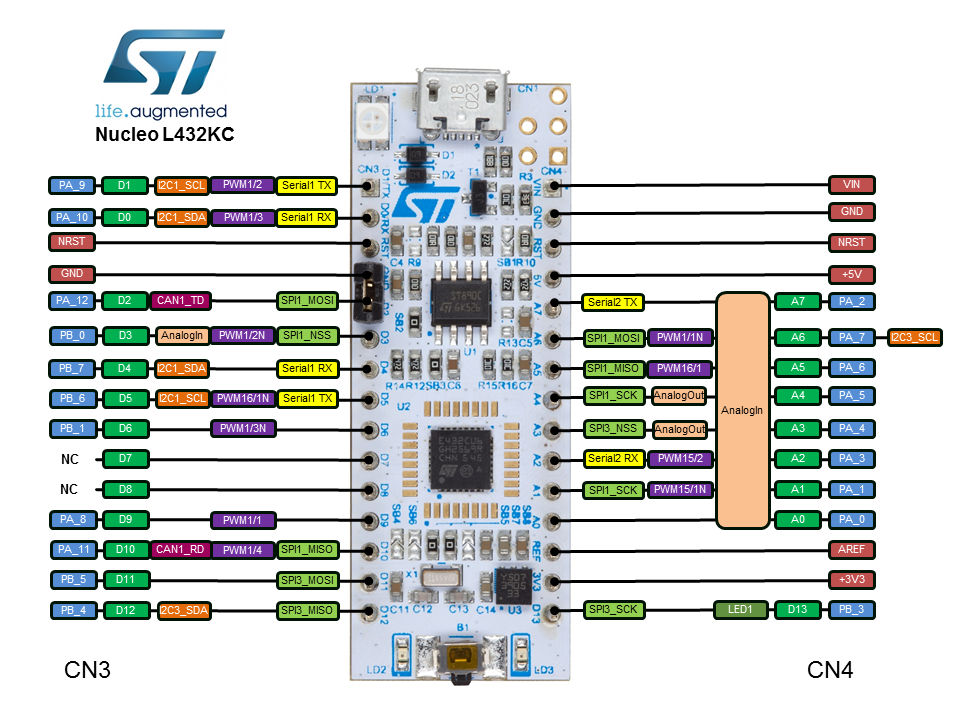

As requested I tested every module which I can test. For SPI I do not have a module and the others I do not know how to test. Every module I have tested works reliably and without any issues. 

Furthermore, I tested a major amount of the clock configuration. The final clock I kept for testing is located in blinky.rs. I tested multiple prescalers and clocks to ensure everything works as it should. 

# Dependencies

Probe-rs
curl --proto '=https' --tlsv1.2 -LsSf https://github.com/probe-rs/probe-rs/releases/latest/download/probe-rs-tools-installer.sh | sh

# Modules tested
* ~~ADC~~
* ~~Blinky (LED)~~
* ~~Button ~~
* ~~Button Exti~~
* CAN
* ~~DAC DMA~~
* ~~DAC~~
* ~~I2C Blocking Async~~
* ~~I2C DMA~~
* ~~I2C~~
* MCO
* ~~RNG~~
* ~~RTC~~
* SPE ADIN1110
* SPI Blocking Async
* SPI DMA
* SPI
* TSC Async
* TSC Blocking
* TSC Multipin
* ~~USART DMA~~
* ~~USART~~

*test*


# Examples for STM32L4 family
Run individual examples with
```
cargo run --bin <module-name>
```
for example
```
cargo run --bin blinky
```




Useful commands for later: 

rust-objdump -h target/thumbv7em-none-eabi/release/blinky

cargo size --bin blinky